# CampSync

A full-stack camp management and workforce administration system built with **ASP.NET Core Web API**, **ASP.NET Core MVC**, **Entity Framework Core**, and **SQL Server**.

CampSync centralizes the operations of a labor/worker camp environment — accommodation (camps, rooms, beds), workforce (workers, supervisors, drivers), transportation (buses, routes, stops), attendance, leave management, and operational reporting — behind a JWT-secured, role-based access model.


---

## Table of Contents

- [Overview](#overview)
- [Architecture](#architecture)
- [Tech Stack](#tech-stack)
- [Database Schema](#database-schema)
- [Role-Based Access](#role-based-access)
- [Getting Started](#getting-started)
- [API Documentation](#api-documentation)
- [Screenshots](#screenshots)
  - [Authentication](#authentication)
  - [Admin Module](#admin-module)
  - [Supervisor Module](#supervisor-module)
  - [Driver Module](#driver-module)
  - [Worker Module](#worker-module)
- [Project Structure](#project-structure)
- [Connect](#connect)

---

## Overview

CampSync is split into two independently deployable ASP.NET Core projects that share a single SQL Server database:

| Project | Type | Responsibility |
|---|---|---|
| `Backend` | ASP.NET Core Web API | Authentication, business logic, EF Core data access, REST endpoints (Swagger-documented) |
| `Frontend` | ASP.NET Core MVC | Razor UI that consumes the Backend API on behalf of the logged-in user |

The Frontend never touches the database directly — every request is routed through the authenticated Backend API, which validates the caller's role before performing any operation.

Four roles drive the entire system: **Admin**, **Supervisor**, **Worker**, and **Driver**.

---

## Architecture

The Frontend (MVC) issues authenticated HTTPS calls to the Backend (Web API), which owns all authentication, authorization, and data access through EF Core against SQL Server. Every write and read is scoped by the caller's role and, for Supervisors, by their assigned camp.

Registration is deliberately restricted: only one Admin account can ever be created through public registration. Every other account — Supervisor, Worker, Driver — is provisioned by that Admin, which keeps privileged account creation centralized and auditable.

---

## Tech Stack

**Backend**
- ASP.NET Core Web API (.NET 8)
- Entity Framework Core 8 — Code-First, migration-driven schema
- SQL Server
- JWT Bearer Authentication
- BCrypt.Net-Next for password hashing
- Swashbuckle / Swagger for API documentation

**Frontend**
- ASP.NET Core MVC (.NET 8)
- Razor Views
- Bootstrap 5, HTML5, CSS3, JavaScript, jQuery

**Tooling**
- Visual Studio 2022, Git/GitHub, EF Core Migrations

---

## Database Schema

| Entity | Description |
|---|---|
| `User` | Core identity record (name, email, password hash, role) shared across all four roles |
| `Camp` | A physical camp — name, location, and its rooms, workers, and supervisors |
| `Room` | A room belonging to a camp, containing multiple beds |
| `Bed` | An individual bed, its occupancy state, and the worker assigned to it |
| `Worker` | Workforce record linked to a camp, a bed, a bus, and optionally a user login |
| `Supervisor` | Links a `User` to the single camp they are assigned to manage |
| `Bus` | Transportation record with capacity, assigned driver, and route stops |
| `Rout_Stop` | An ordered, reorderable stop on a bus route |
| `Attendance` | Daily attendance record for a worker, marked by an Admin or Supervisor |
| `DriverAttendance` | Daily attendance record for a driver, tracked independently of worker attendance |
| `Leave` | Leave request with date range, status, reason, optional rejection reason, and approver |

Schema changes are tracked through versioned EF Core migrations.

---

## Role-Based Access

| Role | Scope |
|---|---|
| **Admin** | Full system access — camps, rooms, beds, buses, routes, workers, supervisors, all attendance, leave approvals, and the reporting dashboard |
| **Supervisor** | Scoped to their assigned camp only — camp workers, camp attendance, and leave review for that camp |
| **Driver** | Their assigned bus, its route stops, and their own driver attendance |
| **Worker** | Their own profile, their own attendance history, and their own leave requests |

---

## Getting Started

### Prerequisites
- [.NET 8 SDK](https://dotnet.microsoft.com/download)
- SQL Server (LocalDB, Express, or a full instance)
- Visual Studio 2022 or the `dotnet` CLI

### 1. Clone the repository
```````bash
git clone https://github.com/<your-username>/CampSync.git
cd CampSync
```````

### 2. Configure the Backend

Set your connection string and JWT secret in `Backend/appsettings.json`:

```````json
{
  "ConnectionStrings": {
    "CampSync": "Server=<your-server>;Database=CampSync;Trusted_Connection=True;TrustServerCertificate=True;"
  },
  "JwtSettings": {
    "Key": "<a-long-random-secret-key>",
    "Issuer": "CampSync",
    "Audience": "CampSyncUsers",
    "ExpiryInDays": 7
  }
}
```````

### 3. Apply migrations
```````bash
cd Backend
dotnet ef database update
```````

### 4. Run both projects
```````bash
dotnet run --project Backend    # Swagger UI at /swagger
dotnet run --project Frontend
```````

### 5. First login
Register the sole Admin account through the Backend's registration endpoint, then sign in through the Frontend. Every other account is created from the Admin module.

---

## API Documentation

The Backend exposes a fully documented REST API via Swagger/OpenAPI, generated directly from the controllers and DTOs. Every endpoint can be explored and tested — including authenticated, role-protected routes — straight from the browser.

<table>
<tr>
<td width="33%" align="center">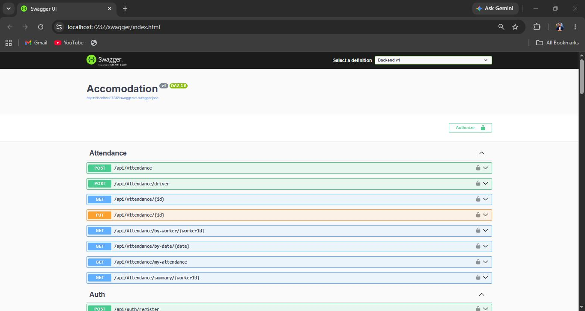</td>
<td width="33%" align="center">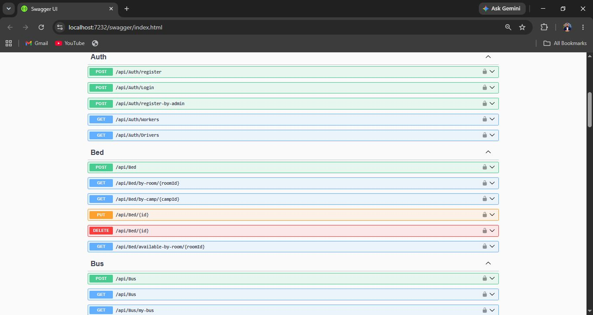</td>
<td width="33%" align="center">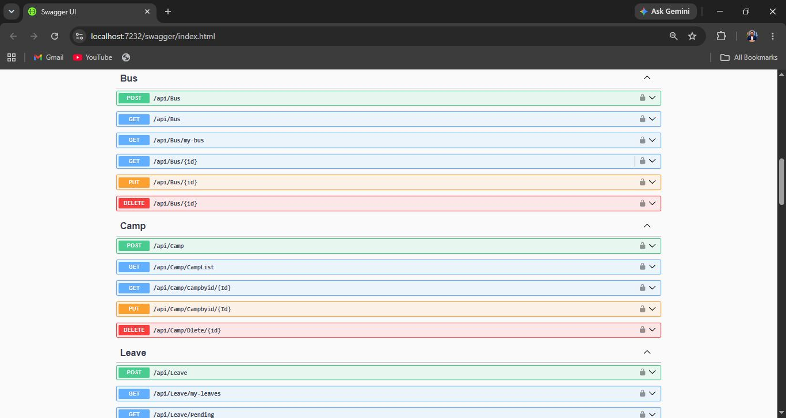</td>
</tr>
<tr>
<td width="33%" align="center">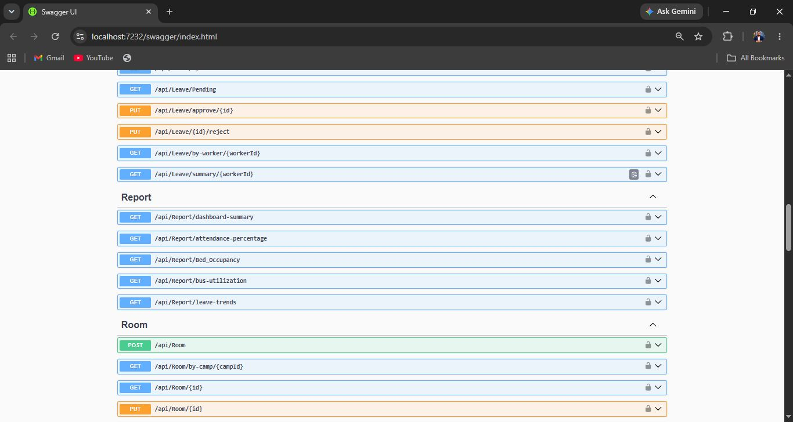</td>
<td width="33%" align="center">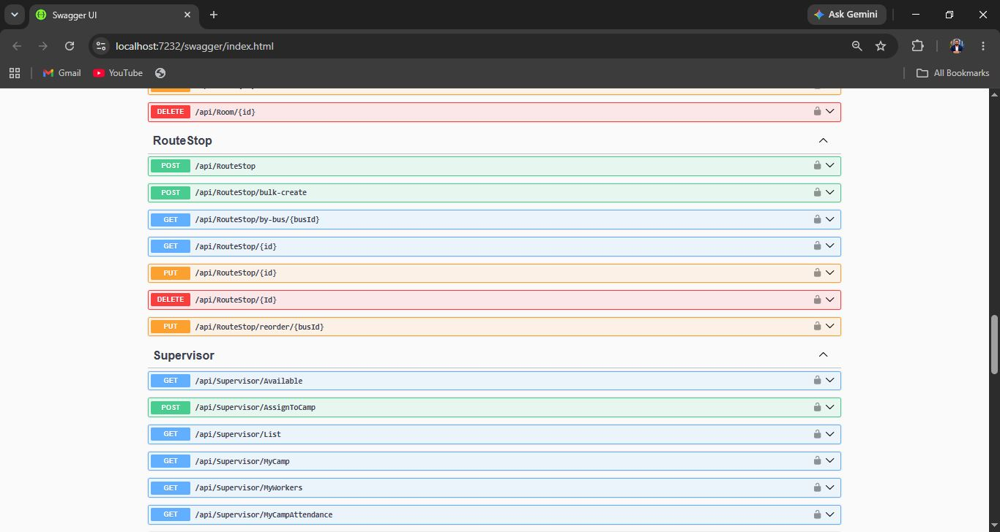</td>
<td width="33%" align="center">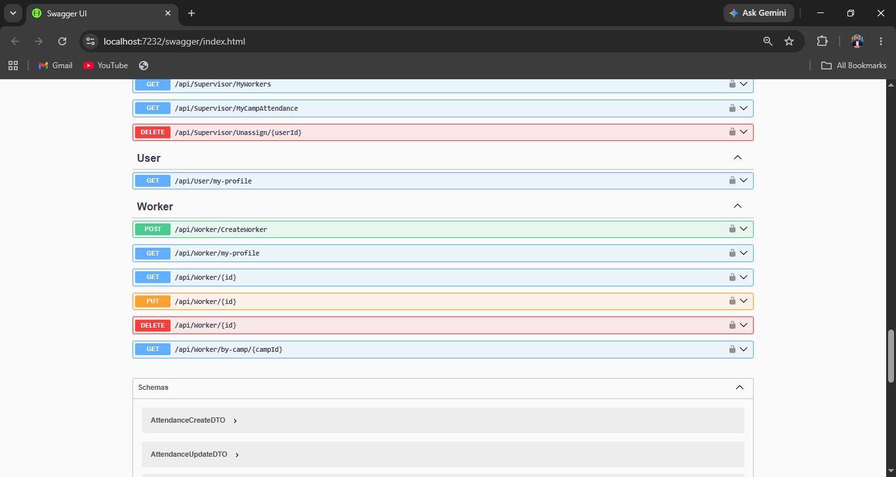</td>
</tr>
</table>

---

## Screenshots

### Authentication

<table>
<tr>
<td width="50%" align="center">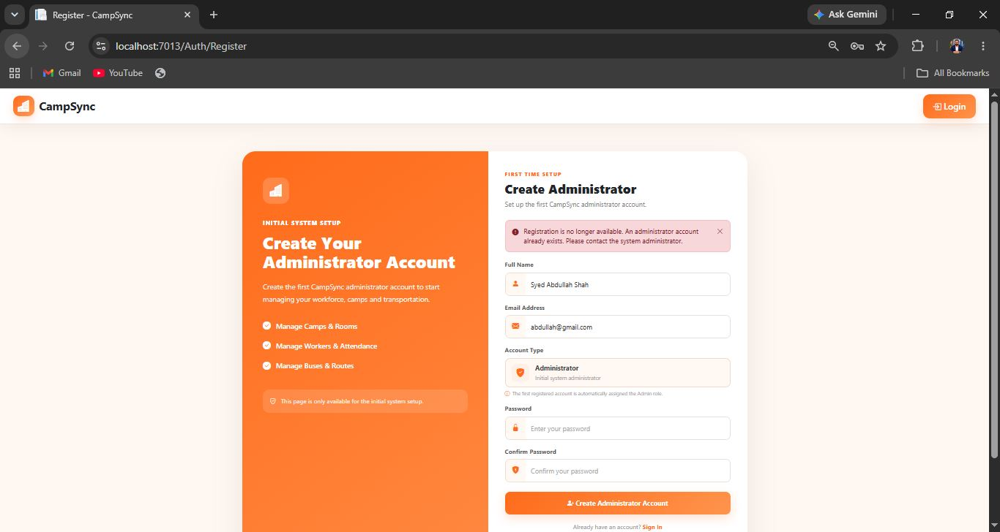<br/><sub>Admin Registration</sub></td>
<td width="50%" align="center">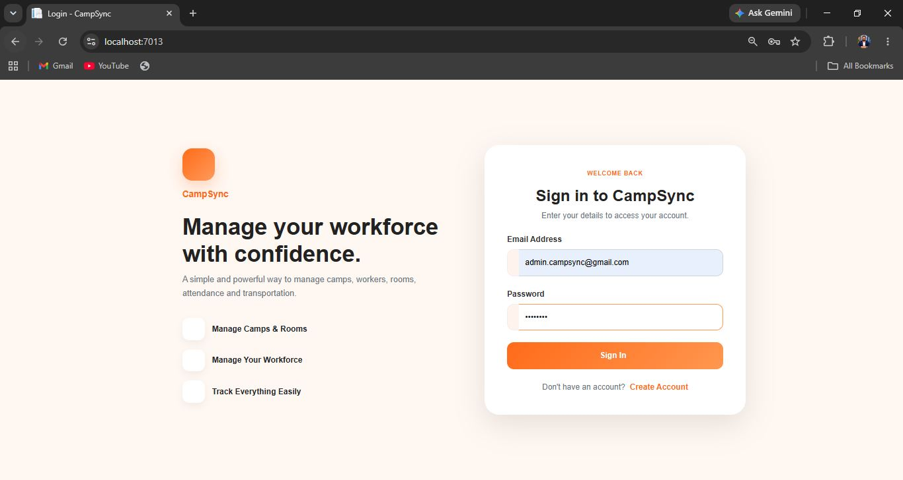<br/><sub>Login</sub></td>
</tr>
</table>

---

### Admin Module

**Camp Management**

<table>
<tr>
<td width="50%" align="center"><br/><sub>Camps Dashboard</sub></td>
<td width="50%" align="center"><br/><sub>Create Camp</sub></td>
</tr>
<tr>
<td width="50%" align="center"><br/><sub>Edit Camp</sub></td>
<td width="50%" align="center"><br/><sub>Delete Camp</sub></td>
</tr>
</table>

**User & Worker Management**

<table>
<tr>
<td width="50%" align="center"><br/><sub>Workers Dashboard</sub></td>
<td width="50%" align="center"><br/><sub>Create Worker</sub></td>
</tr>
<tr>
<td width="50%" align="center"><br/><sub>Delete Worker</sub></td>
<td width="50%" align="center">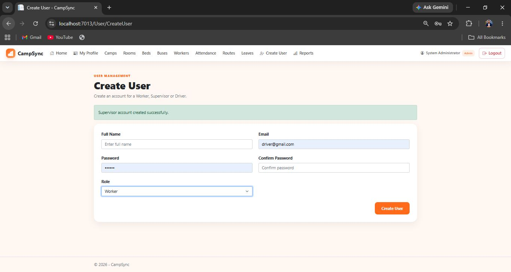<br/><sub>User Accounts</sub></td>
</tr>
</table>

**Supervisor Management**

<table>
<tr>
<td width="50%" align="center"><br/><sub>Supervisors List</sub></td>
<td width="50%" align="center"><br/><sub>Assign to Camp</sub></td>
</tr>
</table>

**Room Management**

<table>
<tr>
<td width="50%" align="center"><br/><sub>Rooms Dashboard</sub></td>
<td width="50%" align="center"><br/><sub>Create Room</sub></td>
</tr>
<tr>
<td width="50%" align="center"><br/><sub>Edit Room</sub></td>
<td width="50%" align="center"><br/><sub>Delete Room</sub></td>
</tr>
</table>

**Bed Management**

<table>
<tr>
<td width="50%" align="center"><br/><sub>Beds Dashboard</sub></td>
<td width="50%" align="center"><br/><sub>Create Bed</sub></td>
</tr>
<tr>
<td width="50%" align="center"><br/><sub>Edit Bed</sub></td>
<td></td>
</tr>
</table>
````````

## Part 2 (Part 1 ke turant baad ye paste karein)

```````
**Bus Management**

<table>
<tr>
<td width="50%" align="center"><br/><sub>Bus Details</sub></td>
<td width="50%" align="center"><br/><sub>Create Bus</sub></td>
</tr>
<tr>
<td width="50%" align="center"><br/><sub>Update Bus</sub></td>
<td width="50%" align="center"><br/><sub>Delete Bus</sub></td>
</tr>
</table>

**Route & Stop Management**

<table>
<tr>
<td width="50%" align="center"><br/><sub>Route Stops Dashboard</sub></td>
<td width="50%" align="center"><br/><sub>Edit Route Stop</sub></td>
</tr>
<tr>
<td width="50%" align="center"><br/><sub>Delete Route Stop</sub></td>
<td></td>
</tr>
</table>

**Attendance Management**

<table>
<tr>
<td width="50%" align="center"><br/><sub>Attendance Dashboard</sub></td>
<td width="50%" align="center"><br/><sub>Mark Attendance</sub></td>
</tr>
<tr>
<td width="50%" align="center"><br/><sub>Attendance Summary</sub></td>
<td width="50%" align="center"><br/><sub>Edit Attendance</sub></td>
</tr>
</table>

**Leave Management**

<table>
<tr>
<td width="50%" align="center"><br/><sub>Leave Dashboard</sub></td>
<td width="50%" align="center"><br/><sub>Pending Leave Requests</sub></td>
</tr>
<tr>
<td width="50%" align="center"><br/><sub>Leave Summary</sub></td>
<td></td>
</tr>
</table>

**Reports & Dashboard**

<table>
<tr>
<td width="33%" align="center"><br/><sub>Dashboard Overview</sub></td>
<td width="33%" align="center"><br/><sub>Attendance & Occupancy</sub></td>
<td width="33%" align="center"><br/><sub>Bus & Leave Trends</sub></td>
</tr>
</table>

---

### Supervisor Module

Supervisors operate within the single camp they are assigned to.

<table>
<tr>
<td width="50%" align="center"><br/><sub>Assigned Camp</sub></td>
<td width="50%" align="center"><br/><sub>Camp Details</sub></td>
</tr>
<tr>
<td width="50%" align="center"><br/><sub>Camp Workers</sub></td>
<td width="50%" align="center"><br/><sub>Worker Details</sub></td>
</tr>
<tr>
<td width="50%" align="center"><br/><sub>Attendance Dashboard</sub></td>
<td width="50%" align="center"><br/><sub>Mark Attendance</sub></td>
</tr>
<tr>
<td width="50%" align="center"><br/><sub>Leave Requests</sub></td>
<td></td>
</tr>
</table>

---

### Driver Module

<table>
<tr>
<td width="50%" align="center"><br/><sub>Driver Dashboard</sub></td>
<td width="50%" align="center"><br/><sub>Assigned Bus & Route Stops</sub></td>
</tr>
<tr>
<td width="50%" align="center">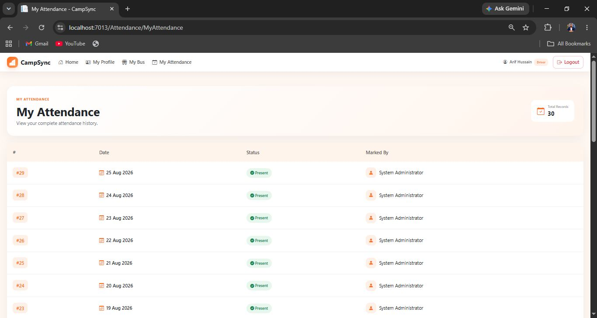<br/><sub>My Attendance</sub></td>
<td></td>
</tr>
</table>

Drivers also use the same self-service leave workflow available to workers.

---

### Worker Module

<table>
<tr>
<td width="50%" align="center"><br/><sub>My Profile</sub></td>
<td width="50%" align="center"><br/><sub>My Attendance</sub></td>
</tr>
<tr>
<td width="50%" align="center"><br/><sub>My Leave Dashboard</sub></td>
<td width="50%" align="center"><br/><sub>Leave Summary</sub></td>
</tr>
<tr>
<td width="50%" align="center"><br/><sub>Apply for Leave</sub></td>
<td width="50%" align="center">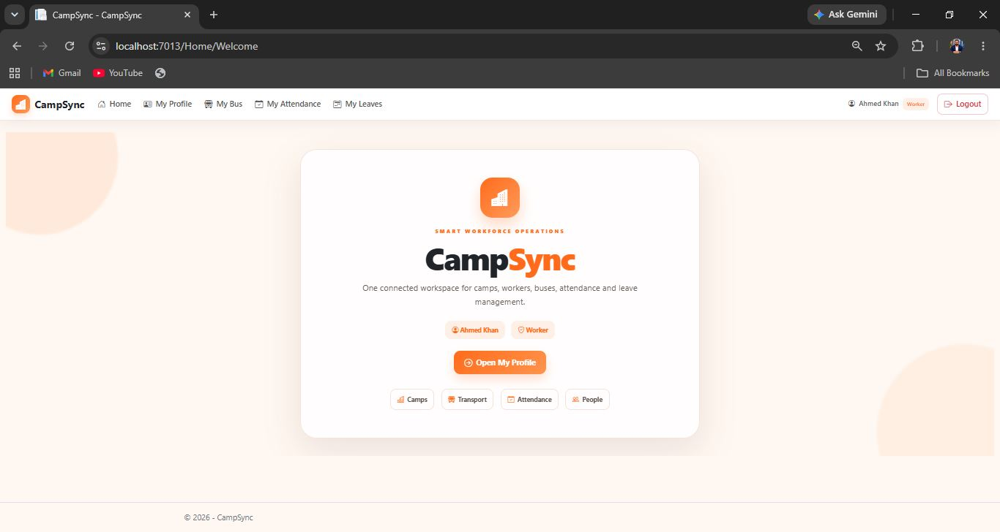<br/><sub>Worker Dashboard</sub></td>
</tr>
</table>

---

## Project Structure

`````
CampSync/
├── Backend/                 ASP.NET Core Web API
│   ├── Controllers/         Auth, Camp, Worker, Supervisor, Room, Bed,
│   │                        Bus, RouteStop, Attendance, Leave, Report, User
│   ├── Models/               EF Core entity classes
│   ├── DTO/                  Request/response data transfer objects
│   ├── Data/                 ApplicationDbContext
│   ├── Migrations/           EF Core Code-First migrations
│   └── Program.cs            JWT auth, Swagger, DbContext configuration
│
└── Frontend/                ASP.NET Core MVC
    ├── Controllers/          MVC controllers calling the Backend API
    ├── Views/                 Razor views per module
    ├── DTOs/                  View-facing data transfer objects
    └── Program.cs
`````

---

## Connect

**Syed Abdullah Shah**
[LinkedIn](https://www.linkedin.com/in/syed-abdullah-shah-52aa7721b/)

Feel free to reach out for feedback, collaboration, or opportunities.
````` `

Agar iske bawajood copy-paste mein masla aaye to jo file maine upar bheji hai wahi sabse reliable tareeqa hai — usme ye exact wahi content bilkul theek se save hai.
